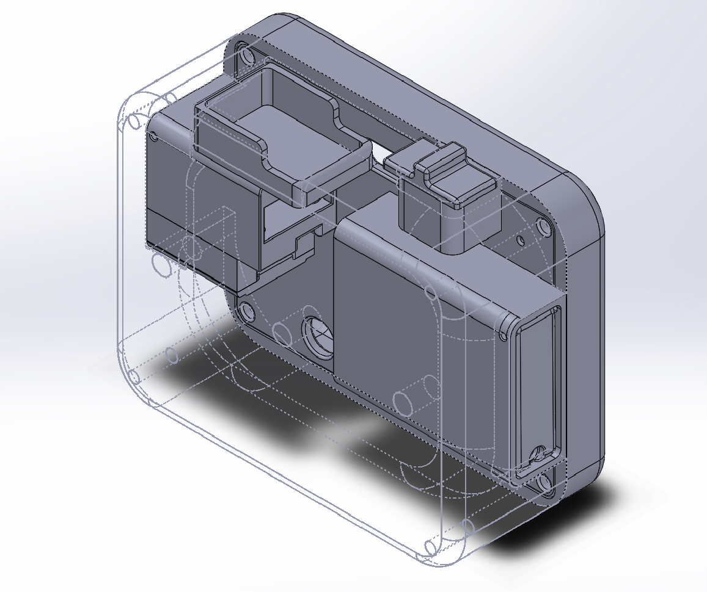
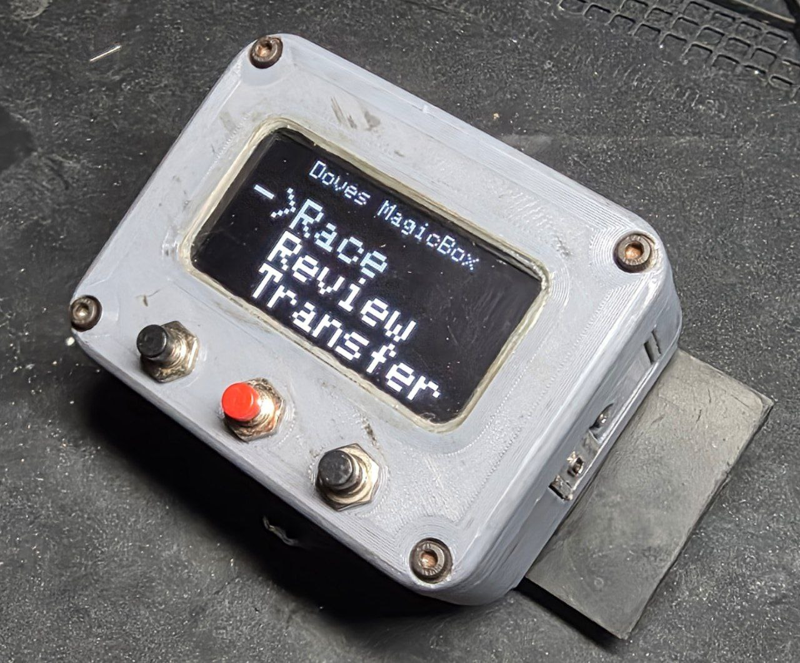
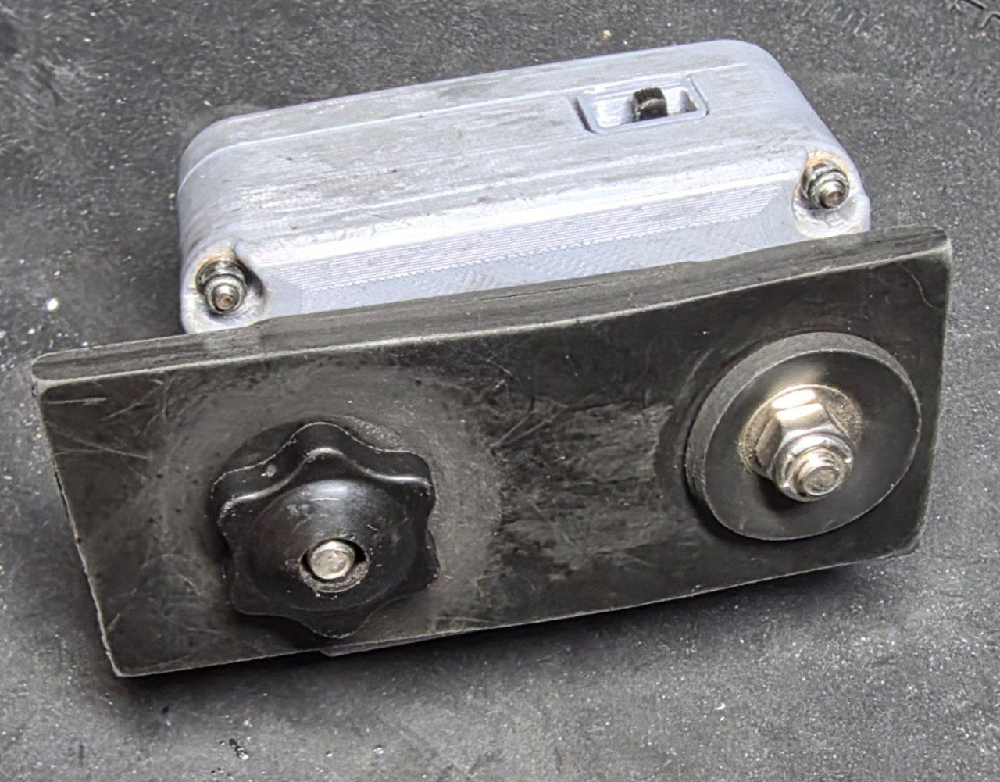

# Datalogger case "build guide"
This is an advance level build, in a very tight case, that i designed on a computer screen where things look much bigger.
I built this, you can too, stay strong.

The build guide is still a to-do... but with a couple of pictures and a pin guide, I think yall got it.... maybe do a dry run on a bench to make sure its wired right :^)

  

  

  

## Materials List
 - bunch of wires
 - Seeed XIAO NRF52840 (sense optional but cooler if you did)
 - sd card slot
 - MATEK SAM-m10Q GPS, super easy to solder up and has a backup battery
 - 2.45" 128x64 OLED LCD (SH110X or SSD1306 compatible)
 - 1500mAh 103050 LiPo
 - 3X 7mm panel mount buttons
 - 1mm Acrylic sheet
 - 4x m3 30mm + nylock nuts
 - 2mm heat inserts, 4mm long
 - metal rod or such for pins on battery and sd card doors

## Mounting Options
option one
 - 1x 5/8ths carriage bolt
 - bolt to kart with washers and such

option two
 - 2x 1/4 carriage bolt
 - 1/16th thick rubber sheet 2in wide
 - 1/4in thick rubber 2in wide
 - cut thin rubber strip same width as device
 - cut thick spray a thumbs width longer
 - >punch holes in straps to match the two outer bolt holes
 - bolt one cariage bolt tight with nylon nut
 - use chunky hand turn nut on other side to allow to quick release/attachment

### Build guide (very much todo)

- print all the parts
- The GPS/SDCard/MCU trays should all be superglued together
- melt heat insert for sd card tray
- line up front/back case with the baseplate between them, mark case holes on baseplate
- glue mcu tower to baseplate with the SD door facing outwards
  - the panel to cover the MCU is screwed on with 4 tiny jewelers screws, don't glue it on unless you hate yourself
- repeat process for power switch
- SOLDER WIRES FOR SD CARD BEFORE GLUING BATTERY TRAY
- add heat insert to battery box
- setup and glue battery to baseplate
  - battery tray might stick out a smidge, sorry
- screw on/solder display
- finish soldering everything else
- be fuckin careful with the wiring 
- [tachometer coming soon, need to hand solder SMD components]

**Note:** Battery ground goes to battery ground on the XIAO, the battery positive goes to the switch, the switch then goes to the battery positive pad on the XIAO

#### Tips
 - add hot glue to GPS so it does not wiggle and ruin the sticker antenna, maybe add a piece of tissue paper to prevent this
 - DONT LET THE BATTERY WIGGLE AROUND, IT WILL CAUSE FAILURE EVENTUALLY
 - stay calm, trust me i know its rough

#### Pin guide

The Seeed XIAO nRF52840 (Sense) has limited pins — almost every one is used. Reference the [official XIAO nRF52840 pinout](https://wiki.seeedstudio.com/XIAO_BLE/) for the physical board layout.

| XIAO Pin | Arduino ID | Function | Connects To |
|----------|-----------|----------|-------------|
| D0 / A0 | 0 | Tachometer input | Tach pickup signal wire (via 1K + 100nF RC filter to GND, optional TVS diode). INPUT_PULLUP, falling-edge ISR. |
| D1 / A1 | 1 | Button 1 (Left) | Panel mount button, other leg to GND (via 10K + 100nF RC filter to GND). INPUT_PULLUP. |
| D2 / A2 | 2 | Button 2 (Select) | Panel mount button, other leg to GND (via 10K + 100nF RC filter to GND). INPUT_PULLUP. |
| D3 / A3 | 3 | Button 3 (Right) | Panel mount button, other leg to GND (via 10K + 100nF RC filter to GND). INPUT_PULLUP. |
| D4 / A4 / SDA | 4 | I2C SDA | OLED display SDA (address 0x3C). Directly wired, no external pullup needed (internal pullups). |
| D5 / A5 / SCL | 5 | I2C SCL | OLED display SCL. Directly wired, no external pullup needed. |
| D6 / TX | -- | GPS UART TX | MATEK SAM-M10Q RX pin (Serial1 TX). |
| D7 / RX | -- | GPS UART RX | MATEK SAM-M10Q TX pin (Serial1 RX). 57600 baud. |
| D8 / SCK | -- | SPI Clock | SD card slot CLK. |
| D9 / MISO | -- | SPI MISO | SD card slot DO (data out). |
| D10 / MOSI | -- | SPI MOSI | SD card slot DI (data in). |
| -- | PIN_SPI_CS | SPI Chip Select | SD card slot CS — **hardwired to GND on the PCB** (always selected, pass -1 to SdFat). |
| -- | PIN_VBAT | Battery ADC | LiPo positive via onboard 1510/510 ohm voltage divider. Only safe `analogRead()` pin. |
| -- | VBAT_ENABLE | Battery ADC enable | Directly controlled — set LOW to enable battery reads. |
| -- | PIN_CHARGING_CURRENT | Charge rate | Set HIGH for fast charging (~100mA). Directly controlled. |
| (internal) | -- | LSM6DS3 IMU | Onboard I2C on Wire1 (Sense variant only), address 0x6A. No external wiring needed. |
| BAT pads | -- | Battery | 103050 1500mAh LiPo. Use the JST connector or solder to the BAT+/BAT- pads. |
| USB-C | -- | Power / Debug | USB-C port for charging, programming, and serial debug. |

**CRITICAL: Do NOT call `analogRead()` on pins D0-D5 (A0-A5).** On the nRF52840, `analogRead()` permanently disables the digital input buffer on that pin for the rest of the session. Every analog-capable pin is dual-purpose (tach, buttons, I2C), so calling `analogRead()` on any of them will silently break that function. PIN_VBAT (pin 32) is the only safe analog pin — it's a dedicated battery ADC with no digital function.

**Power wiring:**
- LiPo connects to the XIAO's battery pads/JST connector (onboard BQ25100 charge IC handles charging via USB-C)
- No external voltage regulator needed — the XIAO regulates 3.3V internally

**Signal wiring tips:**
- Keep tach wire (D0) physically separated from button wires to reduce EMI coupling
- Use shielded cable for tach if possible, ground shield at MCU end only
- RC filters on buttons and tach are strongly recommended for track/racing environments — ignition noise will cause phantom inputs without them
