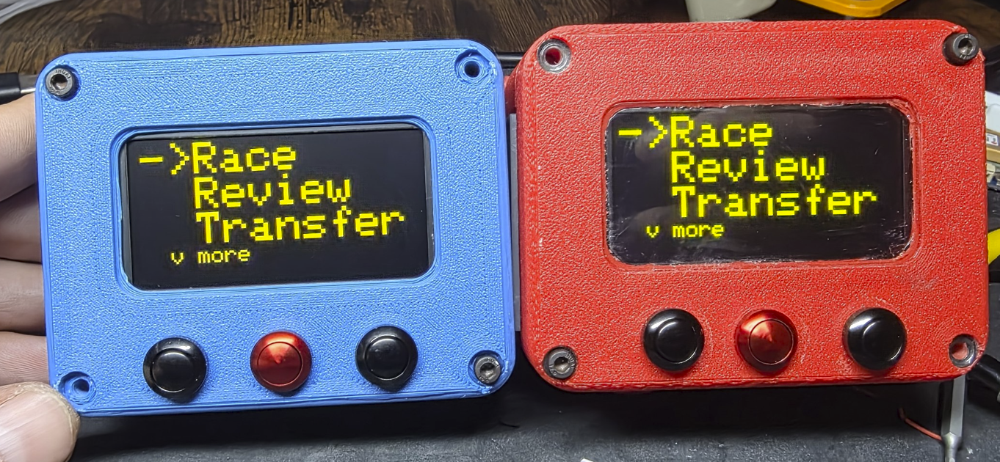
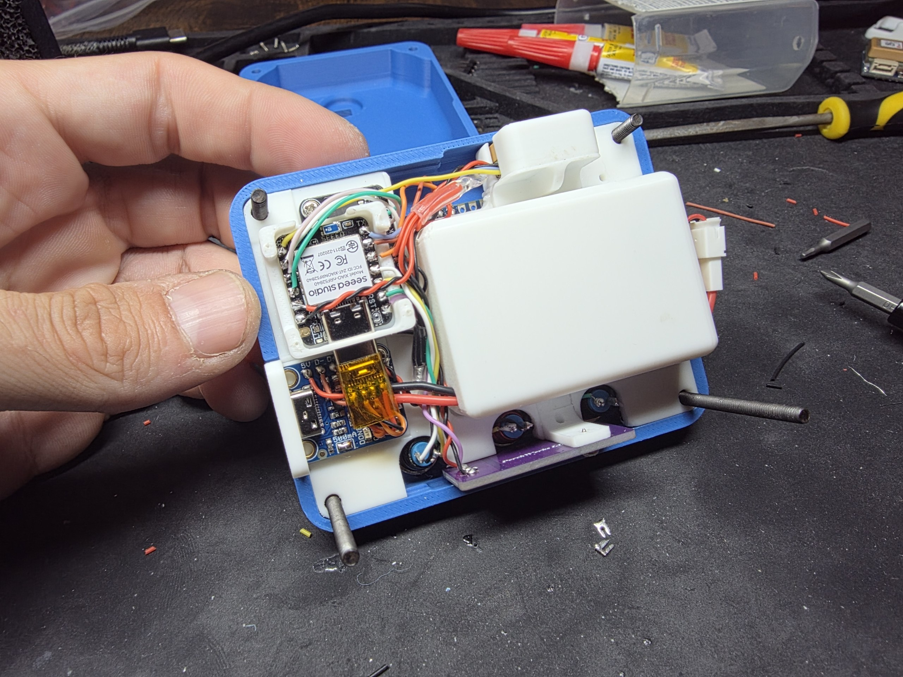
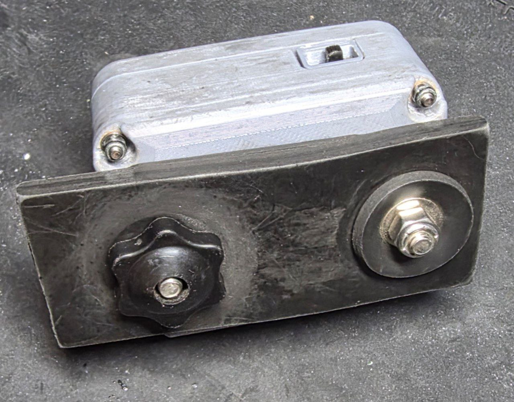

# Datalogger case "build guide"
This is an advance level build, in a very tight case, that I designed on a computer screen where things look much bigger.
I built this, you can too, stay strong.

The build guide is still a to-do... but with a couple of pictures and a pin guide, I think yall got it.... maybe do a dry run on a bench to make sure its wired right :^)

## Preview

  

  

  

## Materials List
Use these parts as a reference, you can buy most of the parts from digikey in a single order

 - Seeed XIAO NRF52840 (sense version optional)
	- https://www.amazon.com/dp/B09T9VVQG7
 - SPI Flash Module
	- https://www.adafruit.com/product/6039
 - USBC Charger Module 
	- https://www.adafruit.com/product/4410
 - MATEK SAM-m10Q GPS, super easy to solder
 	- CAN SUBSTITUTE BARE GPS MODULE
 	- https://www.digikey.com/en/products/detail/u-blox/SAM-M10Q-00B/16672678
 - 2.45" 128x64 OLED LCD (SH110X or SSD1306 compatible)
	- MODIFIED for i2c mode
	- https://www.amazon.com/dp/B0CFF1XC2T
 - 1500mAh 103050 LiPo (or smaller)
	 - https://www.amazon.com/dp/B09DPNCLQZ
 - 3X 8mm panel mount buttons
	- https://www.amazon.com/dp/B0FSZ446QM
 - JST-PH 2.0 Pigtails
	- https://www.amazon.com/dp/B07NWNPB77
 - little USBC-4 pin breakout plug
	- https://www.amazon.com/dp/B0B9N4DHTW
 - tachometer (us shipping only)
 	- https://www.paypal.com/ncp/payment/D5QVSKE7W4CFQ
 - 1mm Acrylic sheet
 - 4x m3 30mm + nylock nuts
 - 8x m3 washers
 - 10x 2mm x 4mm screws
 - 4x 1mm x 4mm screws
 - bunch of 30AWG silicone wires

## Mounting Hardware  (/case-back.3MF)
#### Parts
 - 2x 1/4 carriage bolt 1in long
 - 1x 1/4 nylon nut
 - 1x 1/8 thick 1/4 ID rubber washer
 - 1x 1/4 ID metal washer
 - 1/16th thick rubber sheet 2in wide
 - 1/4in thick rubber 2in wide

#### Assembly
 - cut thin rubber strip same width as device
 - cut thick strinp a thumbs width longer than the device to allow for easier grip
 - punch holes in straps to match the two outer bolt holes
 - bolt one cariage bolt tight with nylon nut and rubber/metal washers
 - use chunky hand turn nut on other side to allow to quick release/attachment

## Mounting Hardware  (/case-back-single.3MF)
#### Parts
 - 1x 5/16 carriage bolt 1-1/4in long
 - 1x 5/16 ID 1/8th thick nylon washer
 - 1x 5/16 nylon nut
 - 1x 5/16 metal washer
 - 1-3x 1/8th rubber washer

#### Assembly
 - nylon washer against datalogger body so it sits off a bit from the wheel
 - rubber washer between datalogger and wheel for vibration dampning
 - metal washer and nut from backside of wheel

---
### Build guide (very much todo)

- print all the parts
- line them up with the cutout
- the MCU tray should overhang towards the USBC charger
- good luck until i cut and upload the build video

#### Tips
 - DONT LET THE BATTERY WIGGLE AROUND, IT WILL CAUSE FAILURE EVENTUALLY
 - DONT LET THE GPS WIGGLE AROUND EITHER
 - bit of paper works great for both
---
#### Wiring guide

The Seeed XIAO nRF52840 (Sense) has limited pins — almost every one is used. Reference the [official XIAO nRF52840 pinout](https://wiki.seeedstudio.com/XIAO_BLE/) for the physical board layout.

| XIAO Pin | Arduino ID | Function | Connects To |
|----------|-----------|----------|-------------|
| D0 / A0 | 0 | Tachometer input | Tach pickup signal wire (via 1K + 100nF RC filter to GND, optional TVS diode). INPUT_PULLUP, falling-edge ISR. |
| D1 / A1 | 1 | Button 1 (Left) | Panel mount button, other leg to GND (via 10K + 100nF RC filter to GND). INPUT_PULLUP. |
| D2 / A2 | 2 | Button 2 (Select) | Panel mount button, other leg to GND (via 10K + 100nF RC filter to GND). INPUT_PULLUP. |
| D3 / A3 | 3 | Button 3 (Right) | Panel mount button, other leg to GND (via 10K + 100nF RC filter to GND). INPUT_PULLUP. |
| D4 / A4 / SDA | 4 | I2C SDA | OLED display SDA (address 0x3C). Directly wired, no external pullup needed (internal pullups). |
| D5 / A5 / SCL | 5 | I2C SCL | OLED display SCL. Directly wired, no external pullup needed. |
| D6 / TX | -- | GPS UART TX | MATEK SAM-M10Q RX pin (Serial1 TX). |
| D7 / RX | -- | GPS UART RX | MATEK SAM-M10Q TX pin (Serial1 RX). 57600 baud. |
| D8 / SCK | -- | SPI Clock | SD card slot CLK. |
| D9 / MISO | -- | SPI MISO | SD card slot DO (data out). |
| D10 / MOSI | -- | SPI MOSI | SD card slot DI (data in). |
| -- | PIN_SPI_CS | SPI Chip Select | SD card slot CS — **hardwired to GND on the PCB** (always selected, pass -1 to SdFat). |
| -- | PIN_VBAT | Battery ADC | LiPo positive via onboard 1510/510 ohm voltage divider. Only safe `analogRead()` pin. |
| -- | VBAT_ENABLE | Battery ADC enable | Directly controlled — set LOW to enable battery reads. |
| -- | PIN_CHARGING_CURRENT | Charge rate | Set HIGH for fast charging (~100mA). Directly controlled. |
| (internal) | -- | LSM6DS3 IMU | Onboard I2C on Wire1 (Sense variant only), address 0x6A. No external wiring needed. |
| BAT pads | -- | Battery | 103050 1500mAh LiPo. Use the JST connector or solder to the BAT+/BAT- pads. |
| USB-C | -- | Power / Debug | USB-C port for charging, programming, and serial debug. |

**Power wiring:**
- LiPo connects to the adafruit battery charger
- adafruit power wiring:
  - wire dead simple usb-c breakout to 5v, ground, data+/- and plug it into the xiao
  - battery and ground pads, to xiao battery pads
  - desolder JST socket on adafruit board, solder pigtail directly to adafruit board

**Signal wiring tips:**
- Keep tach wire (D0) physically separated from button wires to reduce EMI coupling
- Use shielded cable for tach if possible, ground shield at MCU end only
- RC filters on buttons and tach are strongly recommended for track/racing environments — ignition noise will cause phantom inputs without them

---

## Pricing estimates

Pricing calculations were done on 8/6/2026.
Sadly this cannot also account for shipping from various vendors, or being forced to bulk order items like screws

Since I have also needed to buy some bulk I am willing to sell a bundled parts kit + print service
https://www.paypal.com/ncp/payment/5GT3CFJCLHMTE

| Datalogger | 111.21 | Mount A | 4.82 | Mount B | 4.05 |
|----------|----------|----------|----------|----------|----------|
| MCU | 15.9 | carriage bolts | 0.9 | Mounting type B | 4.05 |
| GPS | 13.36 | plastic knob | 1.5 | carriage bolt | 0.98 |
| Memory | 12.5 | rubber strap | 1.69 | nylon washer | 0.9 |
| Power board | 5.95 | rubber guard | 0.2 | rubber washer x3 | 1.89 |
| usbc breakout | 1.75 | lock nut | 0.12 | lock nut | 0.26 |
| Screen | 15 | metal washer | 0.05 | metal washer | 0.02 |
| power pigtail | 0.8 | rubber washer | 0.36 | -- | -- |
| buttons | 15.2 | -- | -- | -- | -- |
| battery | 8 | -- | -- | -- | -- |
| tachometer  | 20 | -- | -- | -- | -- |
| screws | 1.5 | -- | -- | -- | -- |
| wire and such  | 1 | -- | -- | -- | -- |
| acrylic  | 0.25 | -- | -- | -- | -- |
| 3d print | 10 | -- | -- | -- | -- |
| tach wire + print | 3 | -- | -- | -- | -- |

Message support@perchwerks.com if you have any questions, or need help acquiring supplies