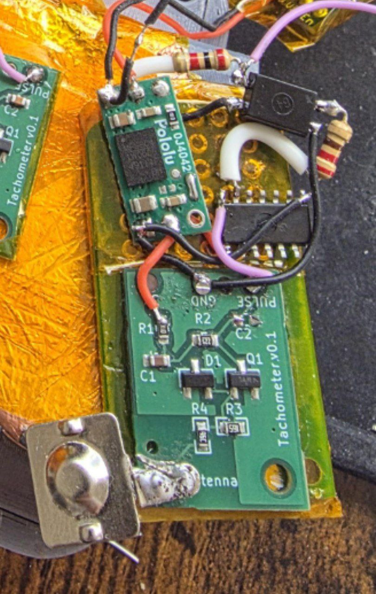

# Tachometer Circuits

I have spent a great deal of work attempting to create a capacitive circuit for sensing RPM. I am not an electrical engineer, but after throwing many things at the wall I am getting something to stick.

Currently If you want a tachometer you will need to source and hand solder SMD components... through hole components aint gonna cut it... sorry

* the first circuit, has a ~9800 RPM (4t wasted spark or 2t) limit due to it generating 5mS pulses each spark.
* the second circuit would work at drastically higher RPMs but I need to make sure the coil ringing isn't causing higher than should-be reads

##### SERIOUSLY

If you decide to build EITHER circuit, if you do not connect an isolated dc-dc converter, you will suffer from serious issues as the powerline swings -10v+

This is the dc-dc converter i used, it can "convert" 3v to 3v

Actual Part Number: MIE1W0505BGLVH
Prototyping part: [https://www.pololu.com/product/5384](https://www.pololu.com/product/5384)

---

Example of the mess I am currently dealing with, I even had a board made for the first version and managed to get it successfully working to prove the proof of concept

  

