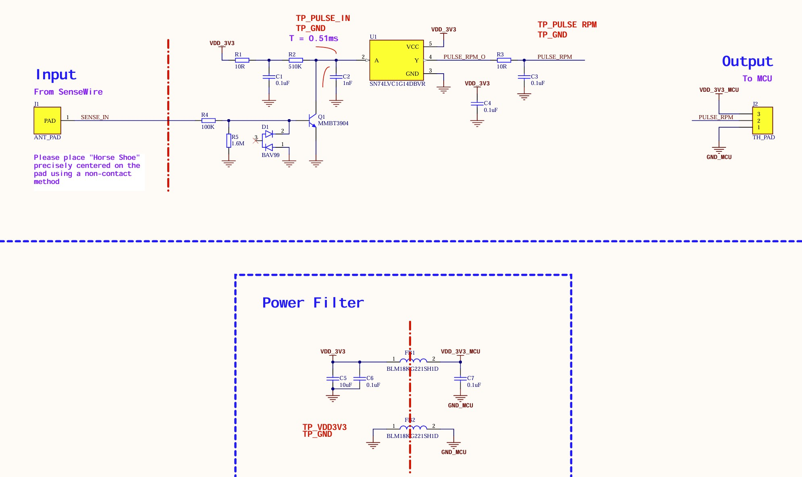
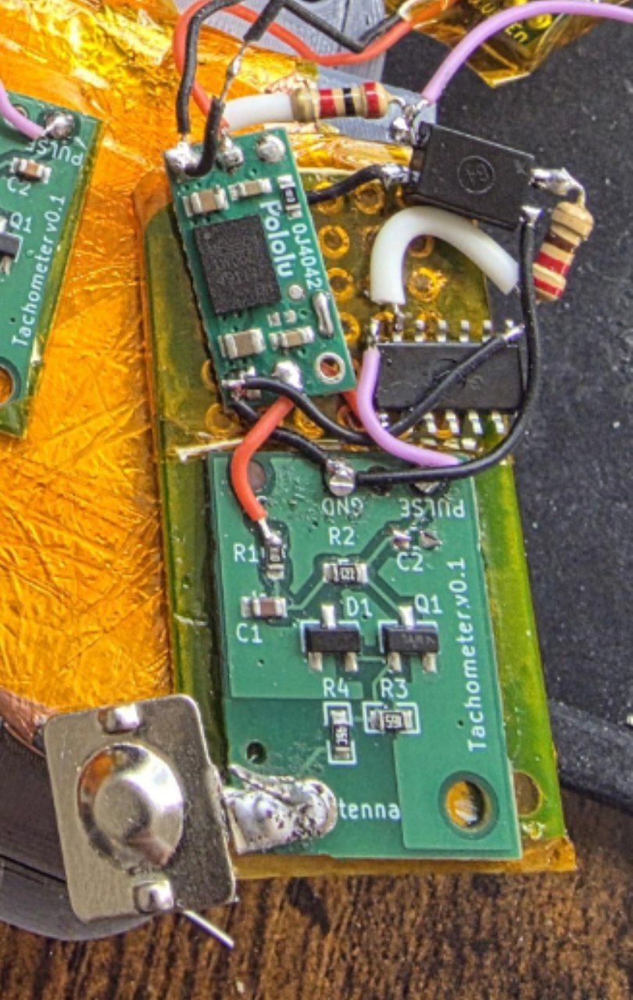
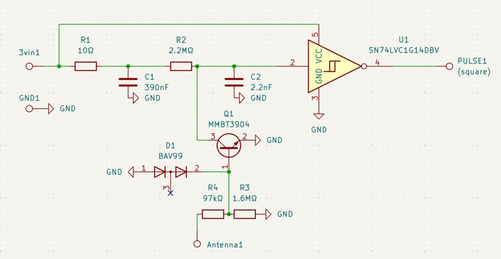
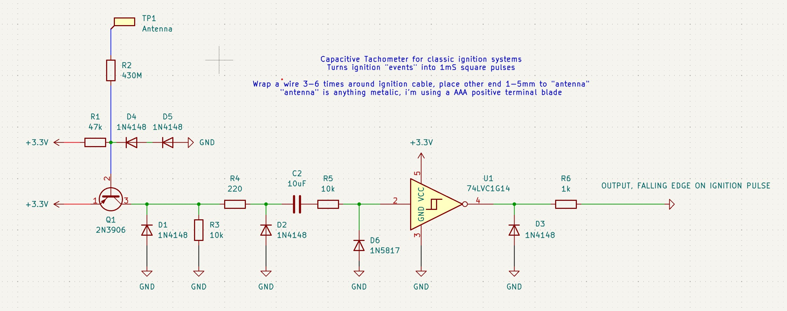

# Tachometer Circuits

### Paid Circuits

Spent well over a year on this, and well I gave up, I want to build a much better datalogger, and this damn circuit is holding me up.

This was designed by a professional RF engineer, and work drastically better than the ones I managed to hobble together.

  

I've built and tested them and they are now available for purchase here
https://www.paypal.com/ncp/payment/D5QVSKE7W4CFQ

### My Circuits

These circuits are semi buildable at home, but really wouldnt reccoment.
If you decide to build EITHER circuit, if you do not connect an isolated dc-dc converter, you will suffer from serious issues as the powerline swings -+10v+ from the magneto driven ignition

* the first circuit, has a ~9800 RPM (4t wasted spark or 2t) limit due to it generating 5mS pulses each spark.
* the second circuit would work at drastically higher RPMs but I need to make sure the coil ringing isn't causing higher than should-be reads

This is the dc-dc converter I used, it can "convert" 3v to 3v. 

Actual Part Number: MIE1W0505BGLVH

Prototyping part: [https://www.pololu.com/product/5384](https://www.pololu.com/product/5384)

And then a schmidt trigger+optocoupler to send the signal out.
The Schmitt Trigger I used is a HEX inverter... you only need one... but the only ICS with one trigger, are super duper small. Both of these are standard cheap parts nothing fancy.

---

Example of the mess I am currently dealing with, I even had a board made for the first version and managed to get it successfully working to prove the proof of concept

  

---

  

---

  

