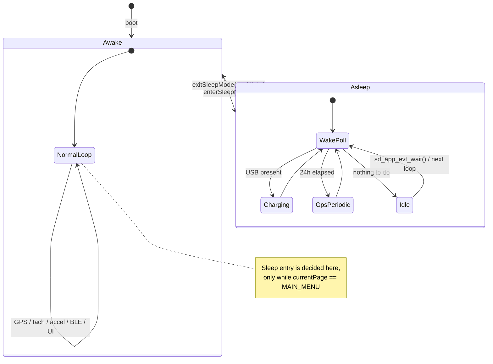
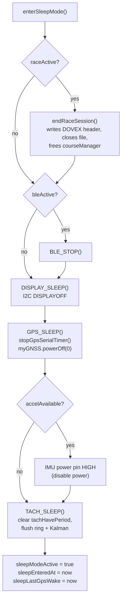
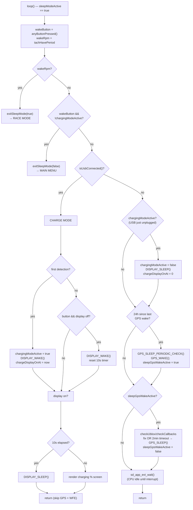
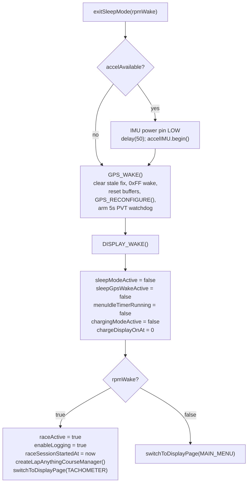

# BirdsEye Sleep System — Current Wiring

> **Status:** Documentation of the system *as it exists today* on `BETA`
> (HEAD `07dabca`). This is a reference for an upcoming redesign — it
> describes current behavior, not desired behavior. Bug findings are in the
> companion section at the bottom.

The sleep subsystem lives almost entirely in `BirdsEye/BirdsEye.ino`
(`enterSleepMode()`, `exitSleepMode()`, the in-`loop()` sleep block, and the
entry call sites), with hardware teardown/wake delegated to the GPS
(`gps_functions.ino`), tach (`tachometer.ino`), display, IMU, and BLE
subsystems.

---

## 1. Top-level state model

There is **one** boolean that defines "are we asleep": `sleepModeActive`.
When it is `true`, `loop()` takes an entirely separate early-return path (the
"sleep loop") and none of the normal racing/logging/UI code runs. When it is
`false`, the normal loop runs and *that* loop is where sleep entry is decided.

Key point: **sleep entry conditions are only ever evaluated on the main
menu** (`currentPage == PAGE_MAIN_MENU`). You cannot auto-sleep from inside a
race, replay, BLE, or USB-MSC page. Wake, by contrast, is evaluated every
loop iteration while asleep.

---

## 2. Entry — how we fall asleep

All three entry triggers live in the normal `loop()` tail
(`BirdsEye.ino:1322-1356`) and all call `enterSleepMode()` then `return`.

| Trigger | Condition | Constant | Location |
|---|---|---|---|
| **Long-press L+R** | `MAIN_MENU` && btn1 held 5 s && btn3 held 5 s | `SLEEP_LONG_PRESS_MS` = 5000 | `BirdsEye.ino:1322` |
| **USB plugged in** | `MAIN_MENU` && `isUsbConnected()` | — | `BirdsEye.ino:1337` |
| **Menu idle** | `MAIN_MENU` && 5 min since last button | `SLEEP_IDLE_TIMEOUT_MS` = 300000 | `BirdsEye.ino:1342` |

The idle timer (`menuIdleTimerRunning` / `menuIdleStartTime`) starts the first
loop the menu is shown, resets on any button press, and is disarmed when you
leave the menu.

### `enterSleepMode()` teardown order (`BirdsEye.ino:1088`)

Notes:
- `endRaceSession()` is a safety net — auto-sleep only triggers from the menu,
  where a race is normally not active, but an RPM-woken race that drifts back
  to menu could be active.
- **The tach ISR stays attached during sleep** — that is deliberate, it is the
  RPM wake source. `TACH_SLEEP()` only clears the latched `tachHavePeriod`
  flag and filter state so the *next* real pulse is what wakes us (otherwise a
  stale flag from boot bounces sleep instantly).

---

## 3. The sleep loop — what runs while asleep

`BirdsEye.ino:1169-1244`. Executed top-to-bottom every `loop()` iteration
while `sleepModeActive`, ending in `sd_app_evt_wait()` (SoftDevice-safe WFE)
so the CPU idles until an interrupt (tach ISR, button GPIO, timer) wakes it.

### Wake sources

| Source | Detection | Result |
|---|---|---|
| **RPM (tach ISR)** | `tachHavePeriod` set by `TACH_COUNT_PULSE()` on any valid pulse | `exitSleepMode(true)` → straight to race mode + logging |
| **Button** | `anyButtonPressed()` (3-sample debounce) | `exitSleepMode(false)` → main menu — *blocked while charging* |
| **USB** | `isUsbConnected()` (VBUS detect) | Does **not** wake — enters charging display mode |

### Charging mode

USB present while asleep does not wake the device; it shows a battery/charge
screen for 10 s (`CHARGE_DISPLAY_TIMEOUT_MS`), then blanks. A button press
refreshes the 10 s window but does **not** exit sleep. While charging, the
GPS-periodic block and the WFE are skipped (early `return`) so the loop spins
faster to keep the charge UI responsive. When USB is unplugged, the next
sleep loop clears charging state and resumes normal sleep.

### Periodic GPS wake

`SLEEP_GPS_WAKE_INTERVAL` = 24 h. In practice almost never fires (units don't
sit asleep for a day). When it does, it wakes the GPS, polls for a fix up to
`SLEEP_GPS_FIX_TIMEOUT` (2 min), then re-sleeps the GPS. **Note:** the PVT
arrival watchdog / baud recovery (`GPS_BAUD_RECOVERY()`) lives in `GPS_LOOP()`,
which does **not** run during the sleep loop — see Findings.

---

## 4. Exit — how we wake up

### `exitSleepMode(bool rpmWake)` (`BirdsEye.ino:1119`)

Two exit paths share all the hardware re-init (IMU, GPS, display, state
reset) and diverge only at the end:

- **RPM wake** (`rpmWake == true`): skips the menu, immediately starts a
  race + logging with a Lap-Anything `CourseManager`, lands on the tachometer
  page. This is the "kart cranked, just start recording" path.
- **Button wake** (`rpmWake == false`): lands on the main menu, no race.

### GPS wake hardening (`GPS_WAKE()`, `gps_functions.ino:588`)

Because the SAM-M10Q keeps config in volatile RAM only, `GPS_WAKE()`:
1. clears stale `gpsDataFresh` / `gpsData.fix`,
2. pokes RX (`0xFF` + 100 ms) to wake the module from backup,
3. resets the serial ring buffer + restarts the TIMER3 drain ISR,
4. re-applies the full VALSET config (`GPS_RECONFIGURE()`, idempotent),
5. arms the 5 s PVT watchdog (`gpsWakeTime` / `gpsWakeValidated`).

If no PVT arrives within 5 s, `GPS_LOOP()`'s watchdog calls
`GPS_BAUD_RECOVERY()` (9600 ↔ 57600 renegotiation). This only works on the
normal wake path, because `GPS_LOOP()` runs in the normal loop.

---

## 5. State variables (single source of truth)

| Variable | Decl | Meaning | Written | Read |
|---|---|---|---|---|
| `sleepModeActive` | `BirdsEye.ino:162` | the master "asleep" flag | enter/exit | loop gate `:1169` |
| `sleepGpsWakeActive` | `:163` | periodic GPS fix in progress | periodic check / exit / poll | `:1225`, `:1231` |
| `sleepEnteredAt` | `:164` | timestamp of sleep entry | enter | *(unused — dead)* |
| `sleepLastGpsWake` | `:165` | last periodic GPS wake time | enter / poll done | `:1226` |
| `sleepGpsWakeStartedAt` | `:166` | when current GPS poll began | periodic check | `:1234` |
| `menuIdleStartTime` | `:167` | menu idle timer base | menu loop | `:1347` |
| `menuIdleTimerRunning` | `:168` | idle timer armed | menu loop / exit | `:1344` |
| `chargingModeActive` | `:169` | USB charge UI active | charge block / exit | `:1178`, `:1194` |
| `chargeDisplayOnAt` | `:170` | charge display-on timestamp (0 = off) | charge block / exit | `:1194`, `:1201` |
| `tachHavePeriod` | `:271` (volatile) | **RPM wake flag** | tach ISR / `TACH_SLEEP()` | `:1172` |

---

## 6. Cross-subsystem touch points

- **Race / logging:** `enterSleepMode()` ends an active session;
  `exitSleepMode(true)` starts a fresh one. `raceActive`, `enableLogging`,
  `raceSessionStartedAt`, `courseManager`.
- **BLE:** stopped on entry (`BLE_STOP()`); never re-enabled on wake (you
  re-enter BLE from the menu). Note the separate auto-reboot-on-BLE-disconnect
  path is unrelated to sleep.
- **GPS:** `GPS_SLEEP()` / `GPS_WAKE()` / `GPS_RECONFIGURE()` /
  `GPS_BAUD_RECOVERY()`; TIMER3 serial-drain ISR stopped on sleep, started on
  wake.
- **Tach:** ISR stays attached (RPM wake); `TACH_SLEEP()` re-arms the flag.
- **IMU:** powered off via `PIN_LSM6DS3TR_C_POWER`; re-`begin()`'d on wake.
- **Display:** `DISPLAY_SLEEP()` / `DISPLAY_WAKE()` (I2C), also driven inside
  charge mode.

---

## 7. Findings (bugs / state-flow risks)

*This section is populated from the deep-dive audit — see the chat summary for
severities and reproduction scenarios.*
</content>
